# College Portal Diagrams

## Fig 1.1 Overall System Architecture Diagram

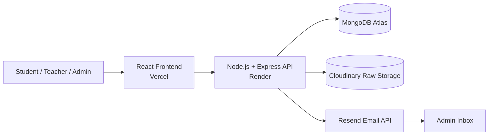

## Fig 1.2 Working Flow of the System

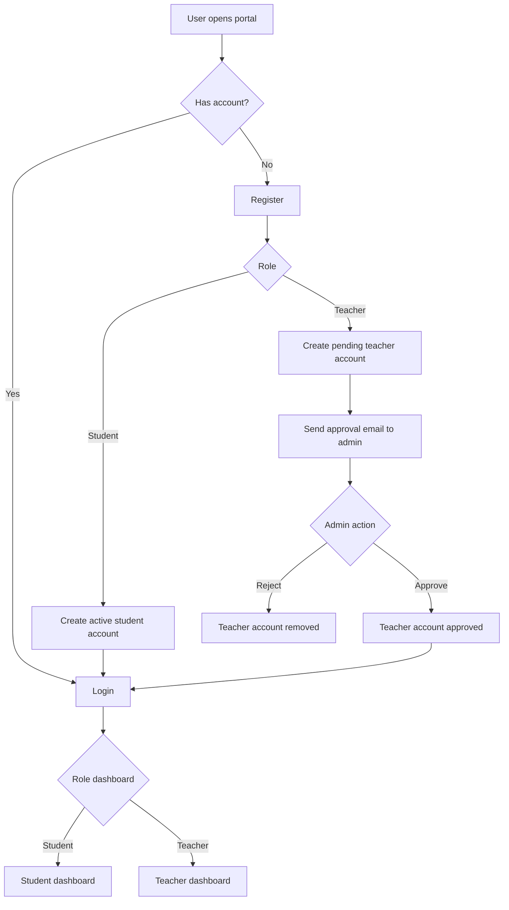

## Fig 2.1 Existing System Model (Manual Resource Sharing)

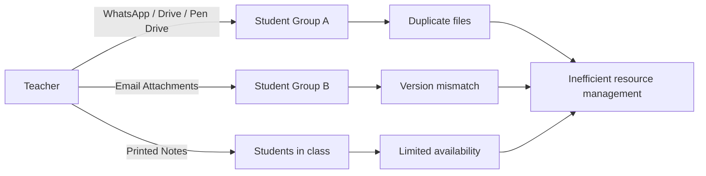

## Fig 3.1 Proposed System Architecture

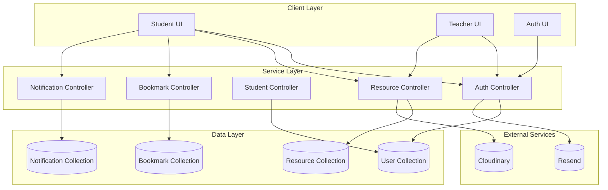

## Fig 4.1 Data Flow Diagram (Level 0)

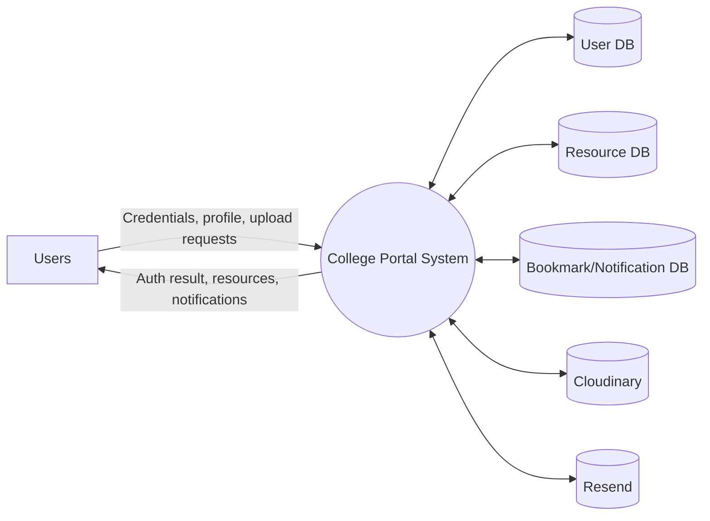

## Fig 4.2 Data Flow Diagram (Level 1)

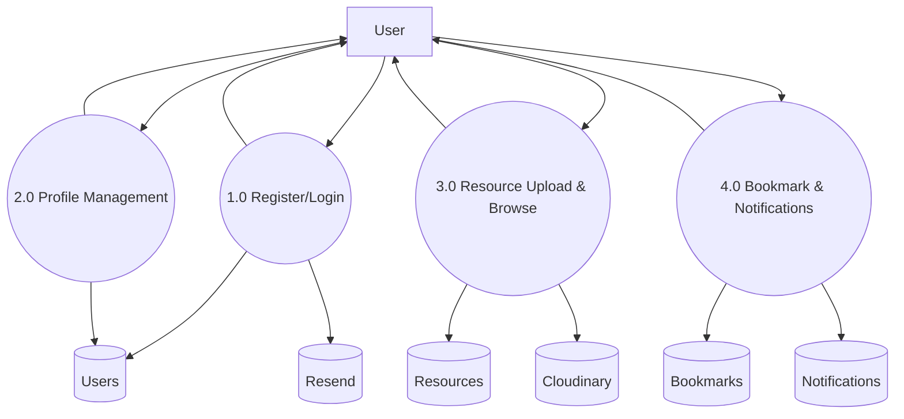

## Fig 5.1 User Login Interface

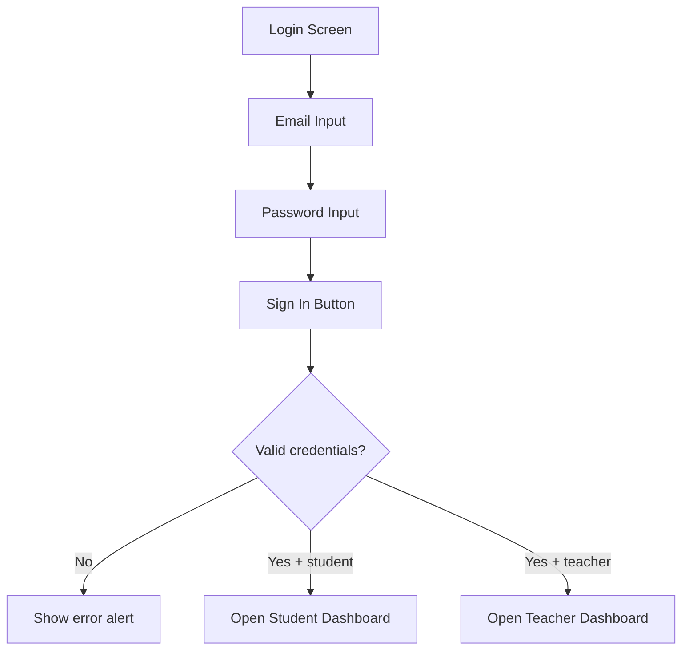

## Fig 5.2 User Registration Interface

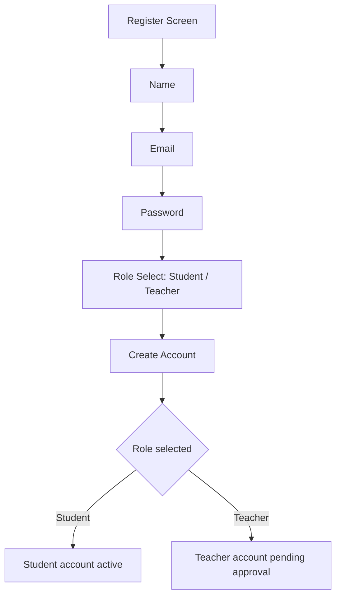

## Fig 6.1 Teacher Dashboard Overview

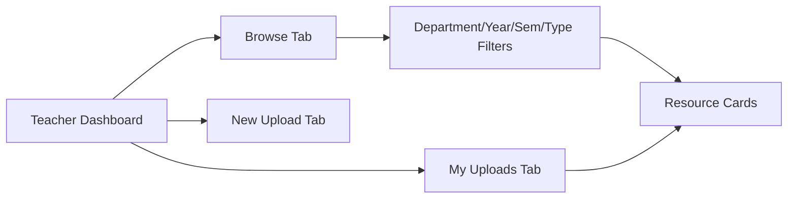

## Fig 6.2 Resource Upload Form

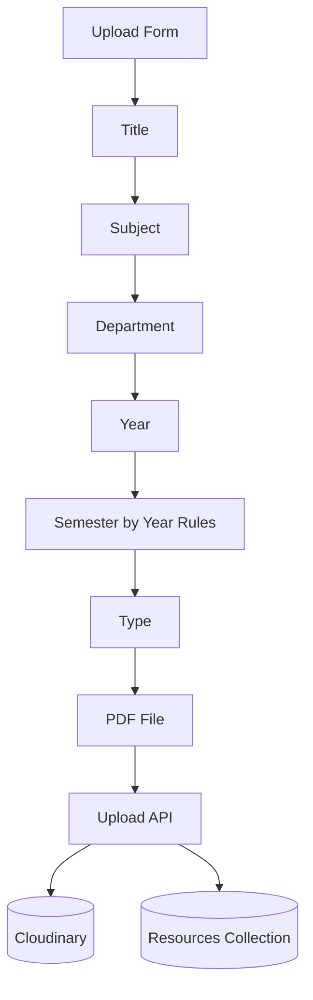

## Fig 6.3 Uploaded Resources View

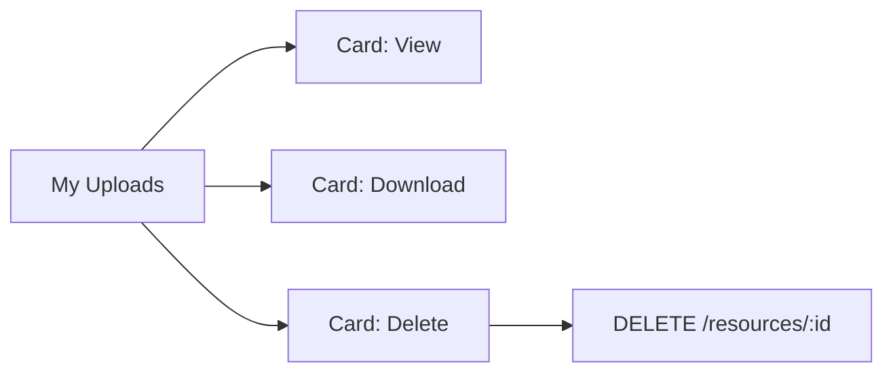

## Fig 7.1 Student Dashboard Overview

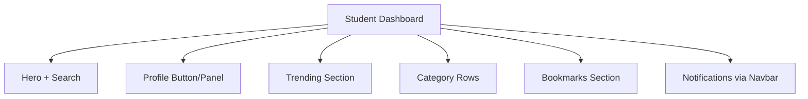

## Fig 7.2 Resource Categories (Card Layout)

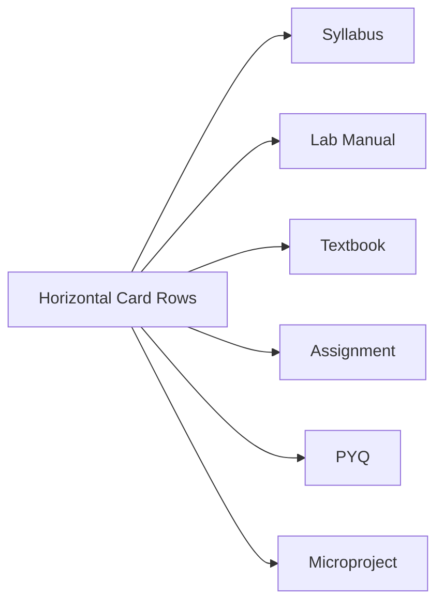

## Fig 7.3 Resource Viewing Interface

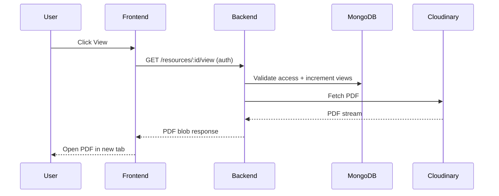

## Fig 8.1 Notification System Interface

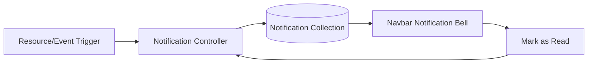

## Fig 8.2 Bookmark System Interface

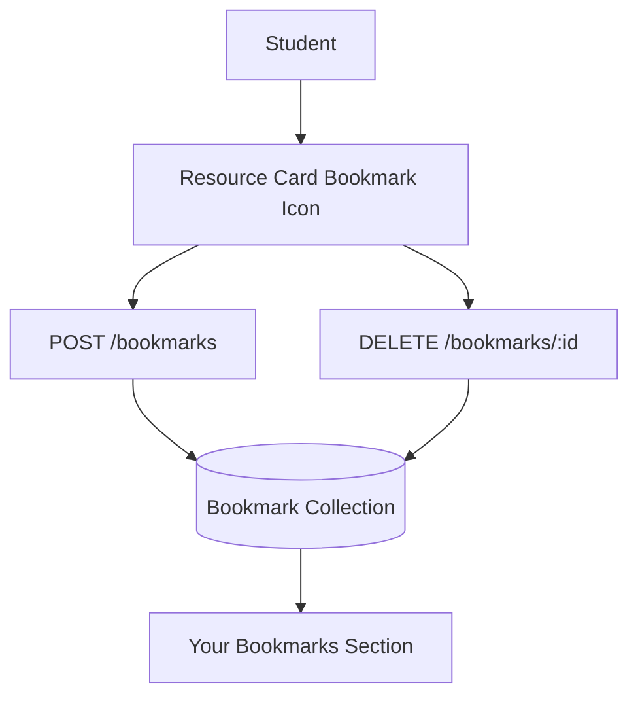

## Fig 9.1 Deployment Architecture (Vercel + Render + MongoDB + Cloudinary)

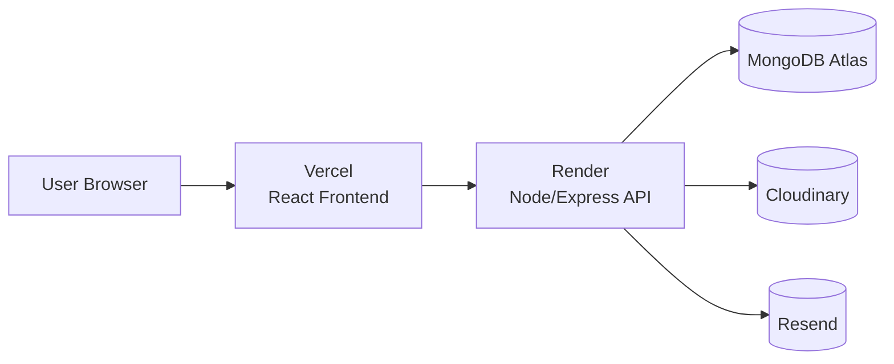

## Fig 10.1 API Request and Response Flow

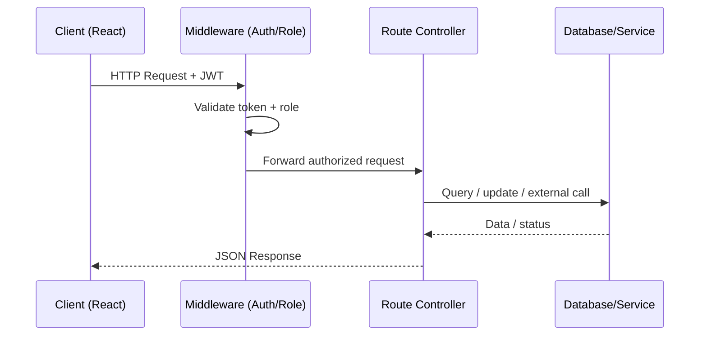

